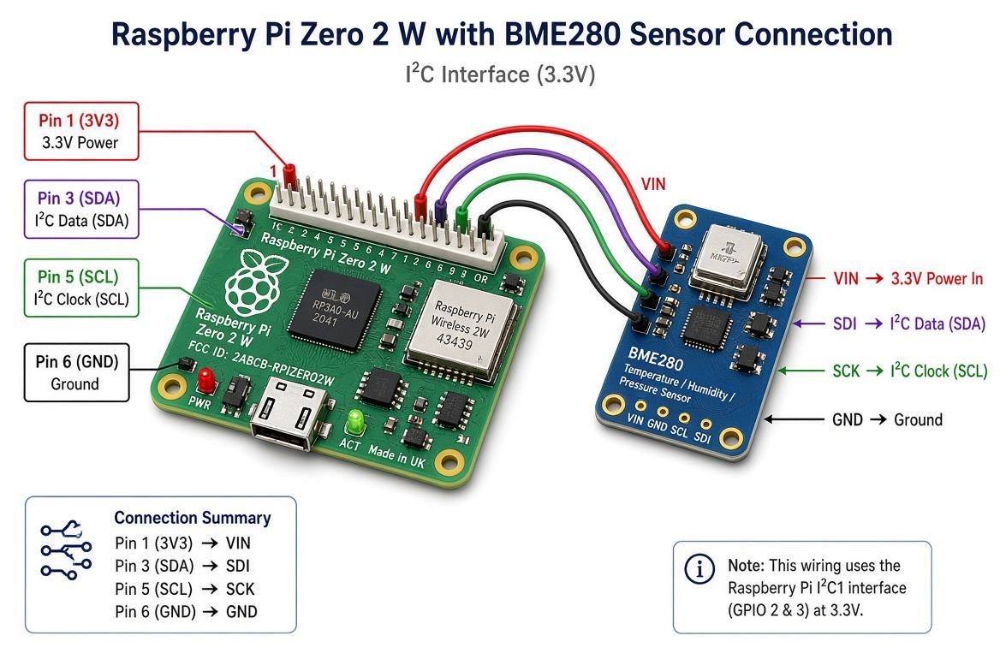
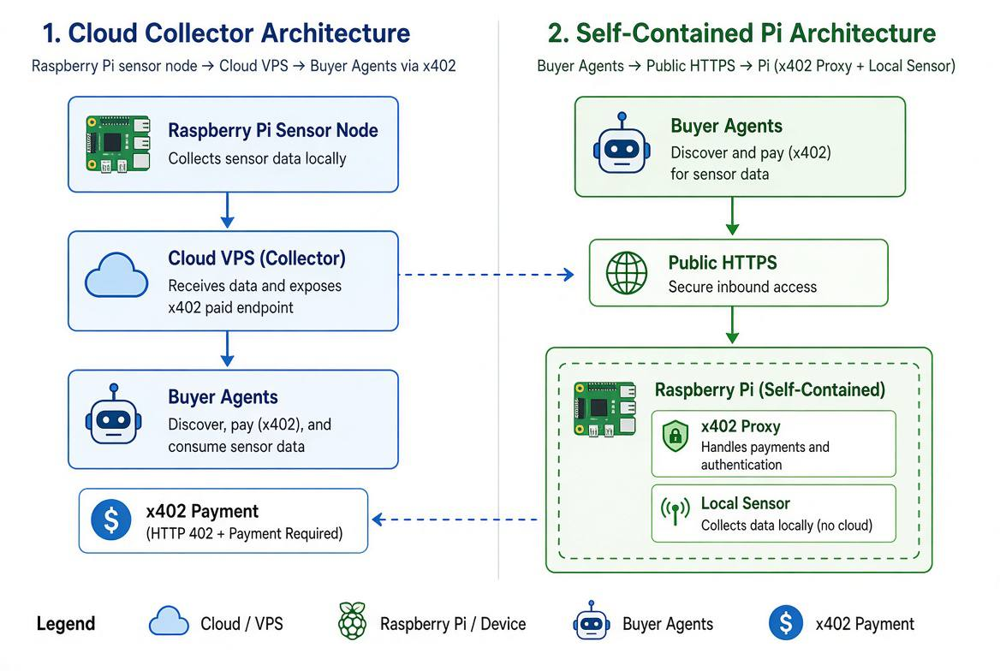
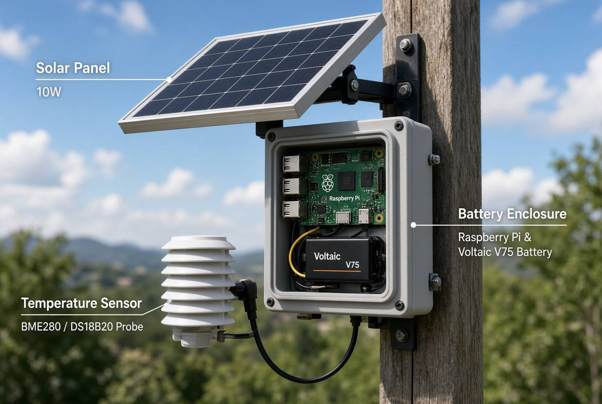

# x402 Temperature Server

Build a small Raspberry Pi weather station that sells live hyperlocal temperature readings to buyer agents through x402.

This is the companion implementation for the weather-bot chapter of *The x402 Handbook*. The book explains the idea. This repo is the build packet: hardware list, wiring diagrams, Raspberry Pi setup, sensor backends, tests, sample output, service setup, cloud and edge deployment options, solar power option, and x402 production notes.

No physical sensor is required for the first demo. The default `simulated` backend produces realistic temperature, humidity, and pressure readings so the API and x402 payment flow can be tested before the BME280 arrives.

The checked-in demo defaults to a city-level Danville, CA station using rounded town coordinates and a current local-weather seed from the nearest public weather observation/forecast. It does not publish a home address or exact private coordinates.



## Repository Status

- Public repo: <https://github.com/darrylsj/x402-temperature-server>
- License: MIT
- Runtime: Python 3.10+ with FastAPI
- Supported sensors: simulated, mock, BME280, DS18B20
- Current tests: Python API tests plus Node proxy architecture tests
- Default mode: local simulated sensor, x402 disabled

## What It Sells

`GET /temperature` returns a fresh reading from the station:

```json
{
  "station": "danville-demo-01",
  "location": "Danville, CA",
  "celsius": 22.22,
  "fahrenheit": 72.00,
  "humidity": 54.0,
  "pressure_hpa": 1017.0,
  "read_at": "2026-08-12T08:00:00Z",
  "ttl_seconds": 60,
  "age_seconds": 0,
  "stale": false,
  "lat": 37.82,
  "lon": -122.00
}
```

The latitude and longitude are rounded on purpose. Sell the weather near you, not your doorstep.

## Build Goals

1. Prove a real physical sensor can produce a paid agent-readable data product.
2. Keep the Pi setup simple enough for a reader to reproduce.
3. Support two production architectures:
   - a cloud collector that receives Pi readings and handles x402 in the cloud;
   - a self-contained Pi endpoint that runs the paid service at the edge.
4. Keep free discovery endpoints available so buyer agents can inspect the service before paying.
5. Keep exact home coordinates, wallet secrets, API keys, and private infrastructure out of the repo.

## Hardware Shopping List

The exact ordering packet is in [docs/hardware-ordering.md](docs/hardware-ordering.md).

Minimum wired prototype:

| Item | Example source | Why |
| --- | --- | --- |
| Raspberry Pi Zero 2 W Starter Kit | PiShop.us | Pi, microSD, power, case, and basic accessories in one bundle |
| Adafruit BME280 I2C/SPI sensor | PiShop.us | Temperature, humidity, and pressure over I2C |
| Female-to-female jumper wires | Included or separate | Connect Pi GPIO to sensor pins |

Optional outdoor additions:

| Item | Example source | Why |
| --- | --- | --- |
| DS18B20 waterproof probe | Adafruit, PiShop, or equivalent | Outdoor temperature probe |
| 4.7k resistor | Common electronics part | Required pull-up for DS18B20 data line |
| Weatherproof enclosure | Any suitable IP-rated enclosure | Protects Pi and wiring |
| Radiation shield | Weather-station accessory | Prevents direct sun from distorting readings |
| Voltaic V75 battery | Voltaic Systems | Always-on 72 Wh USB battery |
| Voltaic 10 W 6 V ETFE panel | Voltaic Systems | Solar charging for the battery |

## Hardware Diagram

Full wiring diagrams are in [docs/hardware-diagrams.md](docs/hardware-diagrams.md).

The visual wiring guide above is included for quick reference. The pin table below is the authority if the breakout board labels differ.

BME280 I2C wiring:

```text
Raspberry Pi Zero 2 W              BME280 breakout
----------------------             ----------------
Pin 1  3V3            -----------> VIN
Pin 6  GND            -----------> GND
Pin 5  GPIO3 / SCL    -----------> SCK / SCL
Pin 3  GPIO2 / SDA    -----------> SDI / SDA
```

Use 3.3 V. Do not feed the sensor from 5 V unless your breakout board explicitly supports it.

## Deployment Options

Detailed architecture trade-offs are in [docs/architecture-options.md](docs/architecture-options.md).



### Option A: Cloud Collector + x402 Seller

```text
Raspberry Pi sensor node
  -> HTTPS POST /sensor-readings
  -> cheap cloud VPS
  -> x402 protected GET /temperature/latest
  -> buyer agents
```

Use this when reliability and multiple sensors matter. The Pi can disappear briefly and the paid endpoint can still answer with freshness metadata.

Recommended cheap host:

- Practical recommendation: RackNerd 1 GB KVM VPS specials, roughly USD 21.99/year when available.
- Strict USD 1/month cost demo: VPS1Dollar, with IPv6-first/NAT64 caveats.
- Mainstream fallback: IONOS VPS XS, usually closer to USD 2/month or higher.

### Option B: Self-Contained Pi x402 Seller

```text
Buyer agent
  -> public HTTPS URL
  -> Raspberry Pi x402 endpoint
  -> local sensor read
  -> paid JSON response
```

Use this when the story matters: the tiny device sells its own data. It is less reliable than the cloud design because the paid endpoint depends on home internet, Wi-Fi, power, and the Pi itself.

## Recommendations Folded Into This Repo

The build uses the recommendations that make the first public reference design more reliable without hiding the edge-computing story.

Accepted:

- Build the wired Pi + BME280 first, then add solar after the sensor path is stable.
- Keep the cloud collector design as the recommended public x402 endpoint.
- Keep the self-contained Pi seller as the second reference design.
- Include `age_seconds` and `stale` in paid responses so buyer agents know whether the reading is fresh.
- Support optional battery fields in the collector payload for solar deployments.
- Use a per-station ingest token when Pi nodes post to the cloud collector.
- Keep exact coordinates, wallet secrets, API keys, and station tokens out of the public repo.

Deferred:

- Persistent cloud storage. The included collector is intentionally in-memory for the first runnable demo; use SQLite, Postgres, Redis, or a small JSON-backed store before treating it as production.
- Low-power battery control. The docs recommend it, but the first hardware order does not include battery telemetry hardware.

Confirmed:

- Real Circle Gateway buyer-wallet test. The public SIM cloud seller endpoint completed 50 paid testnet purchases at `0.001` USDC each with zero failures. See [Paid Buyer Test](docs/paid-buyer-test.md).
- Two public demo URLs. The cloud/SIM route is the Circle Gateway reference design. The direct edge/Pi route is the Coinbase CDP facilitator reference design.
- Live Coinbase edge seller. The public edge deployment now runs with `X402_GATEWAY_MODE=coinbase`; its manifest reports `gateway_mode: "coinbase"` and facilitator `Coinbase CDP`. A legacy Coinbase account/trading API key is not a CDP x402 facilitator credential.

## Local Quick Start

Run the app on a development machine with the simulated sensor:

```bash
python3 -m venv .venv
. .venv/bin/activate
python -m pip install --upgrade pip
python -m pip install '.[dev]'
python -m pytest
python -m x402_temperature_server
```

Try it:

```bash
curl http://127.0.0.1:8080/health
open http://127.0.0.1:8080/demo
curl http://127.0.0.1:8080/temperature
curl http://127.0.0.1:8080/.well-known/x402-temperature.json
```

Expected health response:

```json
{
  "ok": true,
  "station": "danville-demo-01",
  "paid_route": false,
  "x402_mode": "off",
  "collector": false
}
```

## Raspberry Pi Setup

The Pi runbook is in [docs/software-runbook.md](docs/software-runbook.md). Short version:

```bash
sudo apt update
sudo apt install -y git python3-venv python3-pip i2c-tools
git clone https://github.com/darrylsj/x402-temperature-server.git
cd x402-temperature-server
python3 -m venv .venv
. .venv/bin/activate
python -m pip install --upgrade pip
python -m pip install '.[sensor]'
cp .env.example .env
```

Edit `.env` for BME280:

```bash
SENSOR_BACKEND=bme280
I2C_ADDRESS=0x76
ENABLE_X402=false
```

Run it:

```bash
python -m x402_temperature_server
```

## x402 Production Mode

For public seller mode, this repo uses a thin Node/Express payment proxy in front of the Python sensor service. The Python app remains the sensor and payload layer; the proxy handles x402 payment negotiation and settlement.

The two reference architectures deliberately use different facilitator paths:

| Architecture | Public demo | Paid route | Facilitator |
| --- | --- | --- | --- |
| Cloud collector on SIM | `https://x402-temperature.ngrok.app/demo` | `GET /temperature/latest` | Circle Gateway Nanopayments |
| Direct edge/Pi path | `https://x402-temperature-edge.ngrok.app/demo` | `GET /temperature` | Coinbase CDP x402 Facilitator |

That split is the point of the field demo: the same paid Danville weather product can be sold through two deployment patterns and two major hosted facilitator paths.

Deployment truth matters here. The cloud/SIM Circle endpoint is verified with real testnet paid calls. The edge/Pi Coinbase endpoint is also live as the second facilitator path: `X402_GATEWAY_MODE=coinbase` starts successfully with current `CDP_API_KEY_ID` and `CDP_API_KEY_SECRET` values, and the public manifest reports `gateway_mode: "coinbase"`.

Install and test the proxy:

```bash
cd proxy
npm install
npm test
```

Run the local mock-payment architecture test:

```bash
./scripts/test-both-architectures.sh
```

That script starts:

- an edge Python sensor service plus a mock x402 proxy protecting `GET /temperature`;
- a cloud collector Python service plus a mock x402 proxy protecting `GET /temperature/latest`.

Each paid route must return `402 Payment Required` when unpaid and `200` when the local test payment header is present. The mock mode proves the HTTP contract without moving USDC.

For the Circle Gateway path, set `X402_GATEWAY_MODE=circle`, `SELLER_ADDRESS`, `FACILITATOR_URL`, and run a buyer-wallet estimate before making any paid call. Circle Gateway tests require funded Gateway balance on the selected chain. Polygon Amoy credited quickly in the verified run. Base Sepolia also works, but Gateway balance does not appear until Circle's required finality window has passed, so use `scripts/wait-gateway-balance.sh` before paying.

For the Coinbase CDP seller path, set `X402_GATEWAY_MODE=coinbase` and provide the CDP facilitator credentials plus a seller receive address in the runtime environment:

```bash
CDP_API_KEY_ID=...
CDP_API_KEY_SECRET=...
SELLER_ADDRESS=0xYourReceivingWallet
CDP_X402_ENVIRONMENT=development
```

This repo uses Coinbase's `payToConfig: { type: "address", evm: SELLER_ADDRESS }` mode, so the seller does not need `CDP_WALLET_SECRET` just to receive through an existing EVM address. The CDP API key ID/secret authenticate the hosted facilitator. The proxy registers only the paid route, so `/health`, `/demo`, `/openapi.json`, and `/.well-known/x402-temperature.json` remain free.

Coinbase buyer testing is different from Coinbase selling. A buyer that uses `CdpX402Client` needs `CDP_API_KEY_ID`, `CDP_API_KEY_SECRET`, and `CDP_WALLET_SECRET`, because the client provisions and signs with a CDP-managed wallet. Do not rotate an existing project wallet secret casually; create a separate buyer-test project or confirm no other app depends on the existing wallet secret first.

For a tiny sample host with no Node runtime, the Python app also includes a mock x402 gate:

```bash
ENABLE_MOCK_X402=true python -m x402_temperature_server
open http://127.0.0.1:8080/demo
curl -i http://127.0.0.1:8080/temperature
curl -H 'x-payment: test-paid' http://127.0.0.1:8080/temperature
```

This mode is only for endpoint/demo testing. The Node/Express Gateway proxy remains the production seller path. A normal browser address-bar visit to `/temperature` should show the unpaid `402`; use `/demo` to send the local mock payment header from the browser and view the `200` payload.

To expose the demo outside the LAN without router changes, use the [public ngrok demo runbook](docs/public-ngrok-demo.md). Mock mode remains useful for local development, but buyer agents should inspect and pay the proxy URL.

The confirmed Circle Gateway external paid route is:

```bash
circle services pay \
  https://x402-temperature.ngrok.app/temperature/latest \
  -X GET \
  --address "$BUYER_ADDRESS" \
  --chain MATIC-AMOY \
  --max-amount 0.001 \
  --output json
```

The Coinbase CDP edge buyer harness is:

```bash
cd proxy
CDP_API_KEY_ID=... \
CDP_API_KEY_SECRET=... \
CDP_WALLET_SECRET=... \
CDP_X402_ENVIRONMENT=development \
node scripts/pay-coinbase-client.mjs https://x402-temperature-edge.ngrok.app/temperature
```

The older direct FastAPI x402 switch remains in this repo as an educational path:

```bash
ENABLE_X402=true
X402_PRICE_USD=0.001
X402_NETWORK=base
PAY_TO_EVM_ADDRESS=0xYourReceivingWallet
```

Production verification checklist:

1. Unpaid request returns `402 Payment Required`.
2. Free manifest is reachable at `/.well-known/x402-temperature.json`.
3. Paid request returns the JSON reading.
4. Response includes `read_at`, `ttl_seconds`, and rounded coordinates.
5. Buyer can tell whether the reading is fresh or stale.
6. No secrets are committed.

The direct FastAPI x402 path gates `GET /temperature` in self-contained mode and `GET /temperature/latest` in cloud collector mode. The Gateway proxy is still the preferred seller path for production.

## Cloud Collector Mode

Run this mode on the cheap VPS when one or more Pi sensor nodes should post readings to a reliable public endpoint.

Cloud `.env`:

```bash
ENABLE_CLOUD_COLLECTOR=true
STATION_ID=danville-demo-01
STATION_INGEST_TOKEN=replace-with-random-token
READING_TTL_SECONDS=180
INGEST_MAX_AGE_SECONDS=900
ENABLE_X402=false
```

Example ingest request from a Pi node:

```bash
curl -X POST http://127.0.0.1:8080/sensor-readings \
  -H 'Content-Type: application/json' \
  -H 'X-Station-Token: replace-with-random-token' \
  -d '{
    "station": "danville-demo-01",
    "celsius": 22.22,
    "humidity": 54.0,
    "pressure_hpa": 1017.0,
    "read_at": "2026-08-12T08:00:00Z",
    "battery_percent": 84,
    "battery_voltage": 5.08
  }'
```

Fetch the latest stored reading:

```bash
curl http://127.0.0.1:8080/temperature/latest
```

The cloud collector is deliberately simple and in-memory. It proves the API contract. A deployed version should add durable storage and put x402 protection in front of `GET /temperature/latest`.

## Solar And Battery Backup

Solar design is in [docs/solar-power.md](docs/solar-power.md).



Recommended field prototype:

- Voltaic V75 USB Battery Pack, 20,100 mAh / 72 Wh, Always On output
- Voltaic 10 Watt 6 Volt ETFE Solar Panel
- USB-A to micro USB cable for Pi power
- Weatherproof enclosure and mounting hardware

Planning number:

```text
Pi Zero 2 W + Wi-Fi + BME280: plan for 1.0-1.5 W
Conservative daily draw: 1.5 W x 24 h = 36 Wh/day
With conversion overhead: about 43 Wh/day
```

The V75 is the recommended first outdoor battery because a 48 Wh battery is tight for full-time operation.

## Tests

```bash
. .venv/bin/activate
python -m pytest
```

Current tests cover:

- health endpoint
- temperature payload shape in mock mode
- rounded coordinates for privacy
- browser demo page
- simulated sensor mode
- free discovery manifest
- cloud collector ingest and latest-reading endpoint
- cloud collector station-token and old-reading rejection
- mock Gateway proxy tests for the self-contained edge route
- mock Gateway proxy tests for the cloud collector route

## File Map

- `src/x402_temperature_server/app.py` - FastAPI app and routes
- `src/x402_temperature_server/sensors.py` - simulated, mock, BME280, and DS18B20 sensor backends
- `src/x402_temperature_server/payment.py` - optional direct x402 middleware installation
- `proxy/src/server.mjs` - Node/Express Circle Gateway proxy for the paid route
- `proxy/test/architectures.test.mjs` - proxy tests for cloud and edge modes
- `scripts/test-both-architectures.sh` - starts both local architectures and verifies 402/paid-200 behavior
- `docs/hardware-ordering.md` - ordering list and shopping notes
- `docs/hardware-diagrams.md` - wiring diagrams
- `docs/software-runbook.md` - Pi and service setup
- `docs/architecture-options.md` - cloud collector vs self-contained Pi design
- `docs/field-design-recommendations.md` - accepted, deferred, and rejected recommendations
- `docs/solar-power.md` - solar and battery sizing
- `docs/images/` - visual wiring, solar enclosure, and architecture assets
- `samples/` - representative paid and unpaid output
- `systemd/` - Raspberry Pi service unit
- `tests/test_app.py` - offline tests

## Security Notes

- Do not commit wallet private keys, API keys, OTPs, or production `.env` files.
- Publish rounded coordinates only.
- Keep `/health` and `/.well-known/x402-temperature.json` free.
- For cloud ingestion, use per-station ingest tokens.
- For paid data, always include freshness metadata so agents know what they bought.
